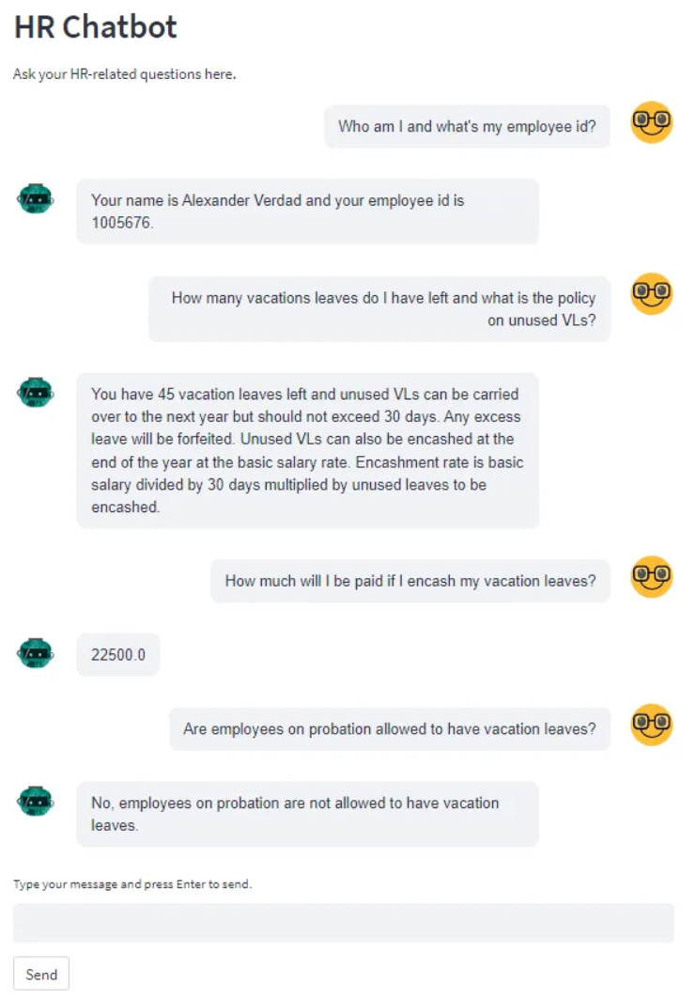
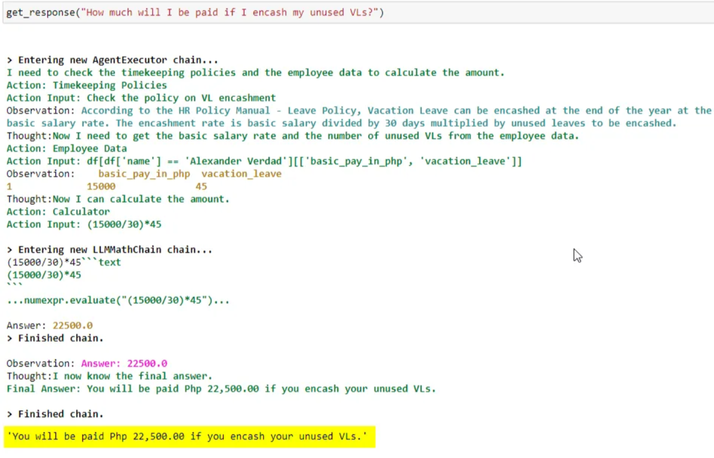

<<<<<<< HEAD
<a href="https://chat.vercel.ai/">
  
  <h1 align="center">Chat SDK</h1>
</a>

<p align="center">
    Chat SDK is a free, open-source template built with Next.js and the AI SDK that helps you quickly build powerful chatbot applications.
</p>

<p align="center">
  <a href="https://chat-sdk.dev"><strong>Read Docs</strong></a> ·
  <a href="#features"><strong>Features</strong></a> ·
  <a href="#model-providers"><strong>Model Providers</strong></a> ·
  <a href="#deploy-your-own"><strong>Deploy Your Own</strong></a> ·
  <a href="#running-locally"><strong>Running locally</strong></a>
</p>
<br/>

## Features

- [Next.js](https://nextjs.org) App Router
  - Advanced routing for seamless navigation and performance
  - React Server Components (RSCs) and Server Actions for server-side rendering and increased performance
- [AI SDK](https://ai-sdk.dev/docs/introduction)
  - Unified API for generating text, structured objects, and tool calls with LLMs
  - Hooks for building dynamic chat and generative user interfaces
  - Supports xAI (default), OpenAI, Fireworks, and other model providers
- [shadcn/ui](https://ui.shadcn.com)
  - Styling with [Tailwind CSS](https://tailwindcss.com)
  - Component primitives from [Radix UI](https://radix-ui.com) for accessibility and flexibility
- Data Persistence
  - [Neon Serverless Postgres](https://vercel.com/marketplace/neon) for saving chat history and user data
  - [Vercel Blob](https://vercel.com/storage/blob) for efficient file storage
- [Auth.js](https://authjs.dev)
  - Simple and secure authentication

## Model Providers

This template uses the [Vercel AI Gateway](https://vercel.com/docs/ai-gateway) to access multiple AI models through a unified interface. The default configuration includes [xAI](https://x.ai) models (`grok-2-vision-1212`, `grok-3-mini`) routed through the gateway.

### AI Gateway Authentication

**For Vercel deployments**: Authentication is handled automatically via OIDC tokens.

**For non-Vercel deployments**: You need to provide an AI Gateway API key by setting the `AI_GATEWAY_API_KEY` environment variable in your `.env.local` file.

With the [AI SDK](https://ai-sdk.dev/docs/introduction), you can also switch to direct LLM providers like [OpenAI](https://openai.com), [Anthropic](https://anthropic.com), [Cohere](https://cohere.com/), and [many more](https://ai-sdk.dev/providers/ai-sdk-providers) with just a few lines of code.

## Deploy Your Own

You can deploy your own version of the Next.js AI Chatbot to Vercel with one click:

[](https://vercel.com/templates/next.js/nextjs-ai-chatbot)

## Running locally

You will need to use the environment variables [defined in `.env.example`](.env.example) to run Next.js AI Chatbot. It's recommended you use [Vercel Environment Variables](https://vercel.com/docs/projects/environment-variables) for this, but a `.env` file is all that is necessary.

> Note: You should not commit your `.env` file or it will expose secrets that will allow others to control access to your various AI and authentication provider accounts.

1. Install Vercel CLI: `npm i -g vercel`
2. Link local instance with Vercel and GitHub accounts (creates `.vercel` directory): `vercel link`
3. Download your environment variables: `vercel env pull`

```bash
pnpm install
pnpm db:migrate # Setup database or apply latest database changes
pnpm dev
```

Your app template should now be running on [localhost:3000](http://localhost:3000).


JAB Changes are as follows:

1. Created .env.local file
2. Modified providers.ts
"// lib/ai/providers.ts
import { customProvider } from "ai";
import { createOpenAI } from "@ai-sdk/openai";
import { isTestEnvironment } from "../constants";

const openai = createOpenAI({
  apiKey: process.env.OPENAI_API_KEY!, // comes from .env.local
});

export const myProvider = isTestEnvironment
  ? (() => {
      const {
        artifactModel,
        chatModel,
        reasoningModel,
        titleModel,
      } = require("./models.mock");
      return customProvider({
        languageModels: {
          "chat-model": chatModel,
          "chat-model-reasoning": reasoningModel,
          "title-model": titleModel,
          "artifact-model": artifactModel,
        },
      });
    })()
  : customProvider({
      languageModels: {
        "chat-model": openai("gpt-4o-mini"),
        "chat-model-reasoning": openai("gpt-4o-mini"),
        "title-model": openai("gpt-4o-mini"),
        "artifact-model": openai("gpt-4o-mini"),
      },
    });
"
3. Install the OpenAI provider "pnpm add @ai-sdk/openai"
=======
# Autonomous HR Chatbot built using ChatGPT, LangChain, Pinecone and Streamlit


Companion Reading: [Creating a (mostly) Autonomous HR Assistant with ChatGPT and LangChain’s Agents and Tools](https://medium.com/@stephen.bonifacio/creating-a-mostly-autonomous-hr-assistant-with-chatgpt-and-langchains-agents-and-tools-1cdda0aa70ef)

---
### TL;DR/Description
---
This is a prototype enterprise application - an autonomous agent that is able to answer HR queries using the tools it has on hand.
It was made using LangChain's agents and tools modules, using Pinecone as vector database and powered by ChatGPT or gpt-3.5-turbo. The front-end is Streamlit using the streamlit_chat component.

Tools:
1. Timekeeping Policies - A ChatGPT generated sample HR policy document. Embeddings were created for this doc using OpenAI’s *text-embedding-ada-002* model and stored in a Pinecone index.
2. Employee Data - A csv file containing dummy employee data (e.g. name, supervisor, # of leaves etc). It's loaded as a pandas dataframe and manipulated by the LLM using LangChain's PythonAstREPLTool
3. Calculator - this is LangChain's calculator chain module, LLMMathChain

#### Sample Chat



#### Sample Tool Use



---

#### How to use this repo

1. Install python 3.10. [Windows](https://www.tomshardware.com/how-to/install-python-on-windows-10-and-11#:~:text=1.,and%20download%20the%20Windows%20installer.&text=2.,is%20added%20to%20your%20path.), [Mac](https://www.codingforentrepreneurs.com/guides/install-python-on-macos/) 
2. Clone the repo to a local directory.
3. Navigate to the local directory and run this command in your terminal to install all prerequisite modules - `pip install -r requirements.txt`
4. Input your own API keys in the `hr_agent_backend_local.py` file (or `hr_agent_backend_azure.py` if you want to use the azure version; just uncomment it in the frontend.py file)
5. Run `streamlit run hr_agent_frontent.py` in your terminal

#### Storing Embeddings in Pinecone

1. Create a Pinecone account in [pinecone.io](pinecone.io) - there is a free tier.  Take note of the Pinecone API and environment values.
2. Run the notebook 'store_embeddings_in_pinecone.ipynb'. Replace the Pinecone and OpenAI API keys (for  the embedding model) with your own.


---
### Tech Stack
---

[Azure OpenAI Service](https://azure.microsoft.com/en-us/products/cognitive-services/openai-service) - the OpenAI service offering for Azure customers.  
[LangChain](https://python.langchain.com/docs/get_started/introduction.html) - development frame work for building apps around LLMs.    
[Pinecone](https://www.pinecone.io/) - the vector database for storing the embeddings.  
[Streamlit](https://streamlit.io/) - used for the front end. Lightweight framework for deploying python web apps.  
[Azure Data Lake](https://azure.microsoft.com/en-us/solutions/data-lake) - for landing the employee data csv files. Any other cloud storage should work just as well (blob, S3 etc).    
[Azure Data Factory](https://azure.microsoft.com/en-ca/products/data-factory/) - used to create the data pipeline.  
[SAP HCM](https://www.sap.com/sea/products/hcm/what-is-sap-hr.html) - the source system for employee data.   

### Video Demo 
---

[Youtube Link](https://www.youtube.com/watch?v=id7XRcEIBvg&ab_channel=StephenBonifacio)

---
### Author
---

#### Stephen Bonifacio

Feel free to connect with me on:

Linkedin: https://www.linkedin.com/in/stephenbonifacio/  
Twitter: https://twitter.com/Stepanogil  
>>>>>>> 693d47d23d0fe88fe6b164776b66c033fa00f9fc
